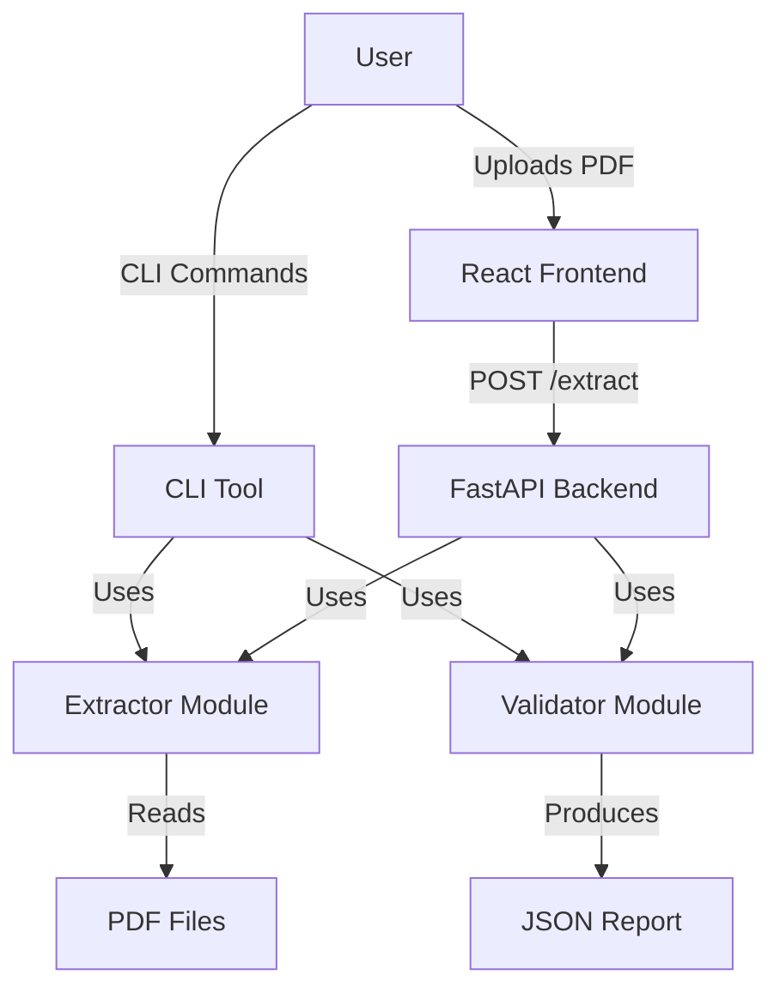

# Invoice QC Service

A complete system for extracting, validating, and managing invoice data from PDFs.

## 🚀 Features
- **PDF Extraction**: Automatically extracts invoice details (Number, Date, Totals, Line Items) using `pdfplumber` and heuristics.
- **Validation Engine**: Checks for completeness, math accuracy (Net + Tax = Gross), and duplicate invoices.
- **CLI Tool**: Powerful command-line interface for batch processing.
- **FastAPI Backend**: REST API for integration.
- **Modern Frontend**: React + Tailwind UI for easy user interaction.

## 🏗 Architecture



## 📂 Folder Structure
```
invoice-qc-service/
├── invoice_qc/       # Core Python Package
│   ├── api.py        # FastAPI App
│   ├── cli.py        # CLI Entrypoint
│   ├── extractor.py  # PDF Extraction Logic
│   ├── schema.py     # Pydantic Models
│   └── validator.py  # Validation Rules
├── frontend/         # React Application
├── ai-notes/         # AI Documentation
├── samples/          # Sample Data
└── requirements.txt  # Python Dependencies
```

## 🛠 Setup

### Backend
1. Create a virtual environment:
   ```bash
   python -m venv venv
   source venv/bin/activate  # Windows: venv\Scripts\activate
   ```
2. Install dependencies:
   ```bash
   pip install -r requirements.txt
   ```
3. Run the API:
   ```bash
   uvicorn invoice_qc.api:app --reload
   ```

### Frontend
1. Navigate to frontend:
   ```bash
   cd frontend
   ```
2. Install dependencies:
   ```bash
   npm install
   ```
3. Run the development server:
   ```bash
   npm run dev
   ```

## 💻 CLI Usage

**Extract Invoices:**
```bash
python -m invoice_qc.cli extract --pdf-dir samples/pdfs --output extracted.json
```

**Validate JSON:**
```bash
python -m invoice_qc.cli validate --input extracted.json --report report.json
```

**Full Run:**
```bash
python -m invoice_qc.cli full-run --pdf-dir samples/pdfs
```

## 🌐 API Usage

**Validate JSON:**
```bash
curl -X POST "http://localhost:8000/validate-json" -H "Content-Type: application/json" -d @extracted.json
```

**Health Check:**
```bash
curl http://localhost:8000/health
```

## 🤖 AI Usage Notes
See `ai-notes/` for details on tools used and example fixes.

## ⚠️ Assumptions & Limitations
- **PDF Layouts**: The extractor uses heuristics (Regex) and assumes standard invoice layouts. Complex or handwritten invoices may fail.
- **Duplicate Detection**: Currently works on a per-batch basis.
- **Line Items**: Table extraction is a "best effort" using spatial analysis.

---
**Video Explanation**: [Link to Video Placeholder]
